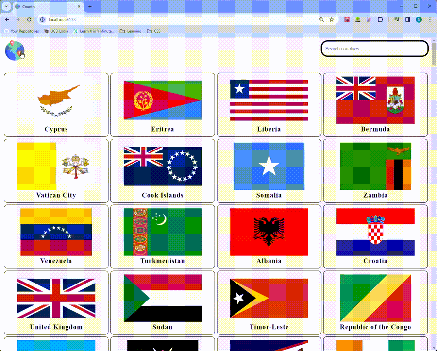

# Country Details App Completed with 2 pages and search bar

This is a simple web application that displays information about different countries. It consists of two pages: the Home page, which lists all countries with their flags and names, and the Detail page, which shows additional information about each country.

## Home Page

- **Description**: The Home page displays all countries along with their flags and names.
- **Fetch URL**: [https://restcountries.com/v3.1/all](https://restcountries.com/v3.1/all)

## Detail Page

- **Description**: The Detail page provides detailed information about a specific country.
- **Fetch URL**: [https://restcountries.com/v3.1/name/{countryName}](https://restcountries.com/v3.1/name/{countryName})

## Attribution

- Country icons used in this project are created by Freepik from [Flaticon](https://www.flaticon.com/free-icons/countries).
- For implementing the search filter functionality, I referred to the following YouTube video tutorial: [Search filter source](https://www.youtube.com/watch?v=xAqCEBFGdYk)

**Note:** Make sure to handle routing in your application using a library like React Router DOM to navigate between the Home and Detail pages.

## Video Demo

